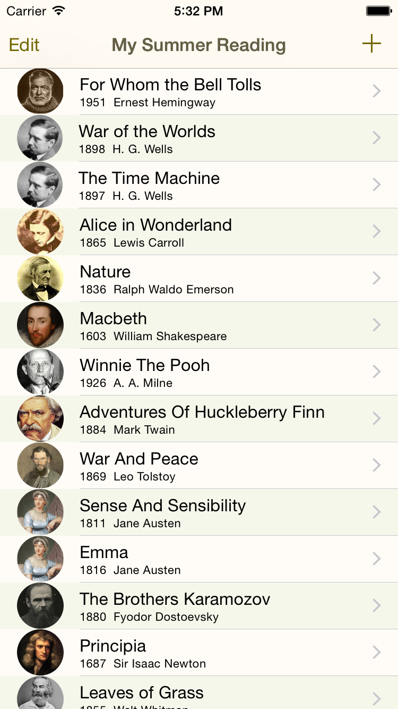

# Swift Reading List
**Cocoa touch (iOS) example written in Swift**

Version 1.0 *(built with Xcode 6.01)*

## Overview
An example app that demonstrates the following:
* Using Swift to target Cocoa touch C and Objective-C frameworks.
* Building and using an iOS 8 framework to share code and resources.
* Working with Key-Value Coding (KVC) APIs in Swift.

Illustrates the use of the Swift language in the implementation of fairly typical Cocoa touch application code. Includes use of the following features of Swift:

* Optionals
* Pattern matching
* Closures
* Extensions
* Swift collections
* Initializers
* Computed properties
* Functional programming with `map` and `reduce`

## Screenshots

&nbsp;&nbsp;&nbsp;

&nbsp;&nbsp;&nbsp;

&nbsp;&nbsp;&nbsp;

## Targets

The project consists of the following Xcode targets:

* **ReadingListModel**

 Objective-C classes that model a reading list containing a list of books and authors, as well as an object store controller written in Swift that serializes and deserializes object graphs stored in plist format.

* **ReadingListModelTests**

 Unit tests written in Swift to exercise *ReadingListModel* Swift and Objective-C classes.

* **ReadingListApp**

 Swift subclasses and extensions of UIKit classes. Storyboard-based. Depends on the *ReadingListModel* target.
 
There's also a **ReadingListAppTests** target that's currently unused.

---

Copyright &copy; 2014, [About Objects, Inc.](http://www.aboutobjects.com) All rights reserved. 